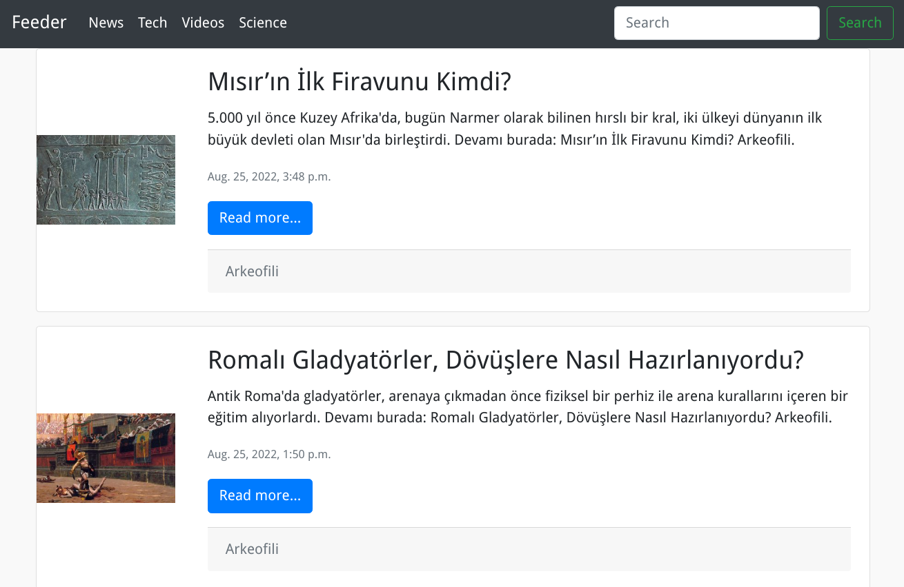

|                Desktop                |                Mobile                |
|:-------------------------------------:|:------------------------------------:|
|  |  |

# Introduction

The goal of this project is to create a simple, yet powerful, reader for RSS feeds.

The project is written with django 4.1 and Python 3.

### Features

* Simple and intuitive interface
* Bootstrap 4 (static files included)
* Procfile for deployment
* SQLite database by default
* Separate settings for development and production(environment variables)
* Custom admin interface

## Installation

- Create a virtual environment and activate it

```bash
python3 -m venv feeder-venv
source feeder-venv/bin/activate
```

- Clone the repository

```bash
git clone https://github.com/mofm/feeder.git
```

- Install dependencies

```bash
pip install -r requirements.txt
```

- Create environment files

```bash
mkdir .env
touch .env/development.env
touch .env/production.env
```

- Add environment variables for your development environment

For production environment, use environment variables from production.env

```bash
SECRET_KEY= (generate a random string: create new secret key)
DEBUG=False
ALLOWED_HOSTS=127.0.0.1 feeder.example.com
```

 - Initial database schema and migrate

```bash
python manage.py makemigrations
python manage.py migrate
```

- Create superuser
    
```bash
python manage.py createsuperuser
```

- Collect static files

```bash
python manage.py collectstatic
```

- You can test out the application by running the following command:

```bash
python manage.py runserver 0.0.0.0:8000
```

## Deployment

- Create gunicorn systemd service files for production environment

```bash
sudo vi  /etc/systemd/system/gunicorn.service
```

```bash
[Unit]
Description=gunicorn daemon
After=network.target

[Service]
Type=notify
User=user
Group=user
EnvironmentFile=/path/to/feeder_venv/feeder/.env/production.env
WorkingDirectory=/path/to/feeder_venv/feeder
ExecStart=/path/to/feeder_venv/bin/gunicorn --workers 3 --bind 0.0.0.0:8000 feeder.wsgi:application
ExecReload=/bin/kill -s HUP $MAINPID
KillMode=mixed
TimeoutStopSec=5
PrivateTmp=true

[Install]
WantedBy=multi-user.target
```

- Create schedule jobs systemd service file for production environment

_This is used to check RSS URLs from feed.ini file and fetch new feeds every 2 minutes_

```bash
sudo vi  /etc/systemd/system/schedule_jobs.service
```

```bash
[Unit]
Description=Feederjobs daemon
After=network.target

[Service]
Type=Simple
User=user
Group=user
EnvironmentFile=/path/to/feeder_venv/feeder/.env/production
WorkingDirectory=/path/to/feeder_venv/feeder
ExecStart=/path/to/feeder_venv/bin/python manage.py startjobs 
ExecReload=/bin/kill -s HUP $MAINPID
KillMode=mixed
TimeoutStopSec=5
PrivateTmp=true

[Install]
WantedBy=multi-user.target
```

- Start and enable gunicorn service

```bash
sudo systemctl start gunicorn.service
sudo systemctl enable gunicorn.service
```

- Login to admin interface and create new category(Example: Tech)


- Add new RSS URL to feed.ini file

```bash
vi  /path/to/feeder_venv/feeder/feed.ini
```

```bash
[EFF]
feed = https://www.eff.org/rss/updates.xml
link = https://www.eff.org
logo = https://www.eff.org/sites/all/themes/phoenix/images/logo-monogram.svg
category = Tech
```

- Start and enable schedule jobs service

```bash
sudo systemctl start schedule_jobs.service
sudo systemctl enable schedule_jobs.service
```

Finally, you can test out the application by browsing to http://localhost:8000/

## Notes
- Default four categories are Tech, Science, News and Videos hardcoded in the application 'url.py' file. You can add new categories by adding new lines in the file and adding new category in the admin interface. Also, you can add index.html file in the templates directory to customize the application.